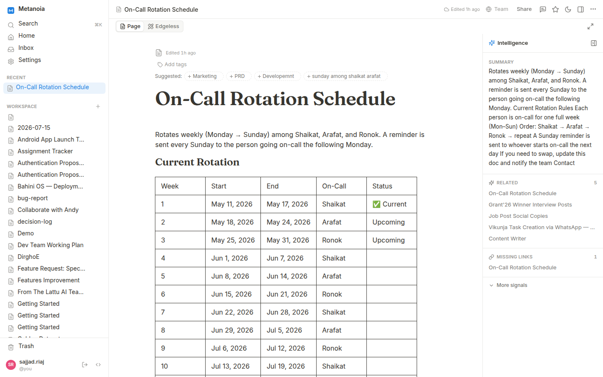

<div align="center">
  
  <h1>MetanoiaDocs</h1>
  <p>
    <b>A self-hosted, real-time collaborative docs workspace.</b><br/>
    Notion-style editing · team &amp; private pages · comments &amp; @-mentions ·
    <b>free, unlimited members, forever</b>.
  </p>
  <p>
    <a href="LICENSE"></a>
    
    
    
  </p>
</div>

<p align="center">
  
</p>

MetanoiaDocs is an open-source alternative to Notion / AFFiNE you run yourself. It
pairs the [BlockSuite](https://github.com/toeverything/blocksuite) block editor with
an original Node/Postgres backend — real-time sync, no proprietary server code, and
**no per-seat pricing, ever**. See [NOTICE](NOTICE).

---

## ✨ Features

- **Real-time collaboration** — live multi-cursor editing and presence over Yjs (Hocuspocus).
- **Rich block editor** — headings, lists, to-dos, tables, databases/kanban, code, LaTeX, images, embeds, toggles.
- **Team & private pages** — every doc is team-visible by default; flip any page to **Private** (owner-only) from the top bar.
- **Comments & @-mentions** — threaded, block-anchored comments; @-mention teammates for an in-app + email notification.
- **Organize** — nested page tree with drag-reorder, colored **tags**, favorites, and folders.
- **Find anything** — hybrid full-text + fuzzy (typo-tolerant) search and a ⌘K command palette.
- **Ambient intelligence** — a per-doc rail that surfaces related pages, auto tag & link suggestions, and extracted tasks / decisions / risks / deadlines, plus duplicate & stale detection. Computed locally in Postgres on save — **no LLM, no external calls**.
- **Version history** — automatic + manual snapshots, non-destructive restore.
- **Public share links** — publish any page read-only, server-enforced.
- **AI assist** — optional OpenAI-compatible copilot, configured in Settings (bring your own key).
- **MCP server** — let AI agents (Claude Desktop/Code, Cursor, …) search, read, and write your docs as you, over the [Model Context Protocol](https://modelcontextprotocol.io). See [`mcp/`](mcp/).
- **Templates** — Daily Journal, Project Plan, OKRs, Retrospective, 1:1, Brainstorm, Roadmap, Reading Notes, and more.
- **Invite-only auth** — username/password or magic-link sign-in; admins invite by email.
- **Polished UX** — minimalist line-icon UI, dark mode, and fully mobile-responsive.

## 🚀 Quick start

Requires [Docker](https://docs.docker.com/get-docker/) (with Compose).

```bash
git clone <your-fork-url> metanoiadocs && cd metanoiadocs
cp .env.example .env        # fill in DB_PASSWORD (and optionally ADMIN_PASSWORD)
docker compose up -d        # first run builds the UI — a few minutes
```

Then open **http://localhost:8092** and sign in as **`admin`** (password from
`ADMIN_PASSWORD`, or `admin123` if you left it unset).

> The single `server` container serves the React UI, the REST API, and the `/sync`
> WebSocket — one origin, one port, no CORS to configure. The `db` volume persists
> your data across restarts.

To invite teammates: **Settings → Members → Invite** by email. With `AUTH_DEV_MODE=true`
the sign-in/invite links are printed to `docker compose logs server` so you can try
the whole flow before wiring up SMTP.

## ⚙️ Configuration

All configuration is environment variables (see [`.env.example`](.env.example)):

| Variable | Required | Default | Purpose |
|---|---|---|---|
| `DB_PASSWORD` | ✅ | — | Password for the bundled Postgres. |
| `BASE_URL` | | `http://localhost:8092` | Public URL used in emailed links. |
| `ADMIN_EMAIL` | | `admin@example.com` | Seeded admin's email. |
| `ADMIN_PASSWORD` | | `admin123` (with a warning) | Seeded admin's password — **set this before exposing the instance.** |
| `AUTH_DEV_MODE` | | `true` | Log sign-in/invite links instead of emailing them. |
| `ALLOWED_EMAIL_DOMAINS` | | `*` | Comma-separated allowlist for sign-in; `*` = any, empty = deny-all. |
| `STALE_MONTHS` | | `6` | A doc untouched this many months shows a "stale" badge in the intelligence rail. |
| `SMTP_HOST` … `SMTP_FROM` | | — | SMTP for real emails (needed once `AUTH_DEV_MODE=false`). |

For production, put a TLS reverse proxy (Caddy, nginx, Traefik) in front of `:8092`
and set `BASE_URL` to your `https://` domain.

## 🧱 Architecture

```
                 ┌─────────────────────────── server (:8092) ───────────────────────────┐
Browser ── HTTPS ─┤  Express — REST API  ·  Hocuspocus /sync (Yjs)  ·  static React SPA   │
                 └───────────────────────────────┬──────────────────────────────────────┘
                                                 │
                                          Postgres (docs, Yjs state, users, ...)
```

| Path | What it is |
|---|---|
| `web-react/` | React 18 + Vite + TypeScript + Tailwind + Radix, BlockSuite 0.22.4 editor. |
| `server/` | Express + Postgres + Hocuspocus (Yjs) sync + magic-link/password auth. Owns the intelligence layer (`intelligence.js`) and search. |
| `mcp/` | Stdio MCP server exposing the workspace to AI agents via personal API tokens. |
| `docker-compose.yaml` | `db` + `server` (a multi-stage image builds the UI, then serves API, `/sync`, and the built SPA from one container). |

The schema is idempotent — it's created/migrated on every server boot, so there are
no manual migration steps. Per-doc intelligence signals are computed synchronously on
each save and backfilled for existing docs on the first boot after upgrading.

## 🛠️ Development

Run the two halves directly (hot reload), without Docker:

```bash
# 1. Postgres (or use the compose db):  docker compose up -d db
# 2. API + sync
cd server && npm install && DATABASE_URL=postgres://… npm start   # :8092
# 3. UI (Vite dev server proxies /api and /sync to :8092)
cd web-react && npm install && npm run dev                        # :5173
```

`npm run build` in `web-react/` produces the static bundle the server serves in
production.

## 📱 Mobile

MetanoiaDocs is a mobile-responsive **web** app. For an installable app:

- **PWA** — add to your home screen today; works offline for the shell.
- **Capacitor** — wrap the same build for the App Store / Play Store without a rewrite.

(The editor core, BlockSuite, is web-only, so a React Native port isn't practical.)

## 🤝 Contributing

Issues and PRs are welcome. Keep changes focused, run `npm run build` in `web-react/`
before submitting, and describe the user-facing change in the PR.

## 📄 License

[MIT](LICENSE) © Xephyr Labs and the MetanoiaDocs contributors.
Bundles [BlockSuite](https://github.com/toeverything/blocksuite) (MIT) — see [NOTICE](NOTICE).
